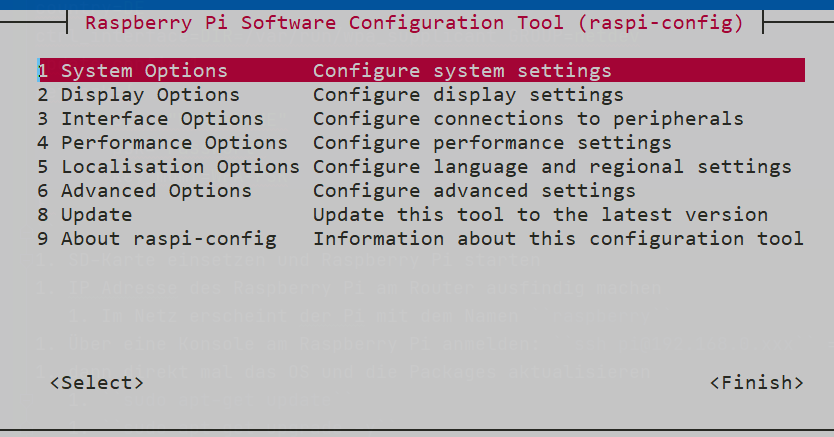

# pi-install
Für den Raspberry PI gibt es eine hohe Anzahl von [Betriebssystemen](https://www.elektronikpraxis.vogel.de/45-betriebssysteme-fuer-den-raspberry-pi-a-488934/).

Im ersten Schritt wird das ``Raspberry Pi OS`` beschrieben und genutzt.

## Raspberry Pi OS
1. [Raspberry Pi Imager](https://www.raspberrypi.org/software/) laden und installieren
1. Image auf eine SD-Karte mit dem Raspberry Pi Imager übertragen
   1. erstmal ohne Desktop anfangen\
   
1. In der Boot-Partition die leere Datei ``ssh`` im root-Verzeichnis ablegen. Damit ist es möglich sich per ssh zum Pi zu verbinden.
1. In der Boot-Partition die Datei ``wpa_supplicant.conf`` im root-Verzeichnis ablegen.\
````editorconfig
country=DE 
ctrl_interface=DIR=/var/run/wpa_supplicant GROUP=netdev
update_config=1
network={
       ssid="WLAN-NAME"
       psk="Passwort"
       key_mgmt=WPA-PSK
}
````
1. SD-Karte einsetzen und Raspberry Pi starten
1. IP Adresse des Raspberry Pi am Router ausfindig machen
   1. Im Netz erscheint der Pi mit dem Namen ``raspberry``
1. Über eine Konsole am Raspberry Pi anmelden: ``ssh pi@192.168.0.xxx`` => Default Passwort `raspberry`
1. dann direkt mal das OS und die Packages aktualisieren
   1. ``sudo apt-get update``
   1. ``sudo apt-get upgrade -y``
1. und den Pi konfigurieren
   1. ``sudo raspi-config``\
   
       1. vollen speicherplatz der SD-Karte nutzen (6 -> A1)
       1. Sprache (5 -> L1)
       1. Zeitzone (5 -> L2)
       1. Passwort von User `pi` ändern (1 -> S3)
       1. Hostname ändern, wenn mehrere Raspberry Pi's im Einsatz sind (1 -> S4)
